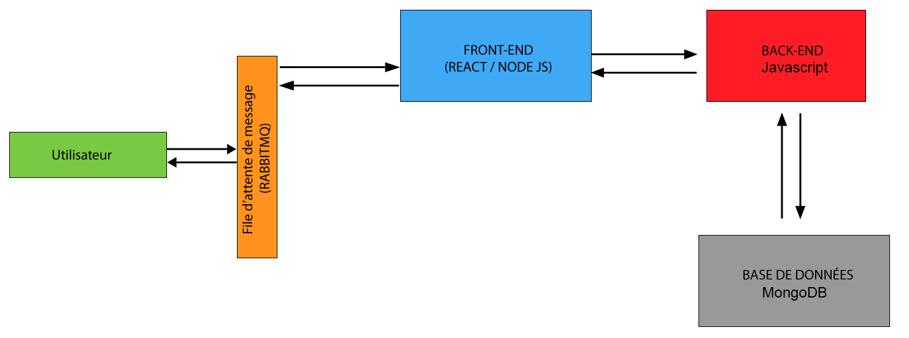
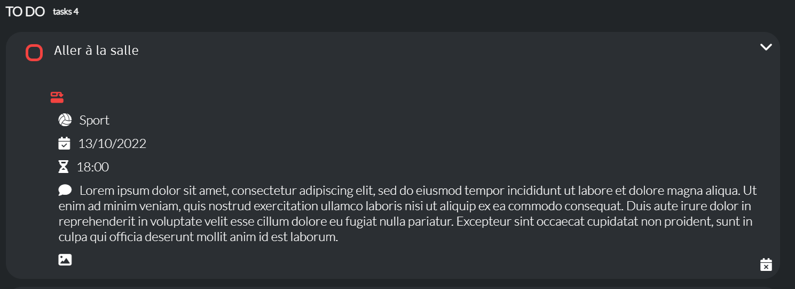
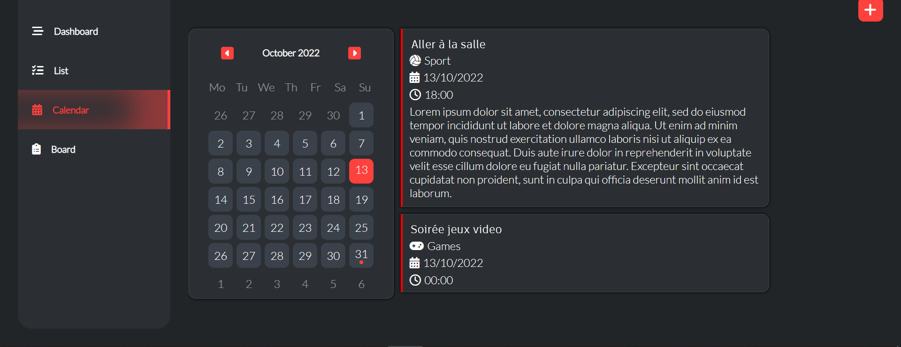
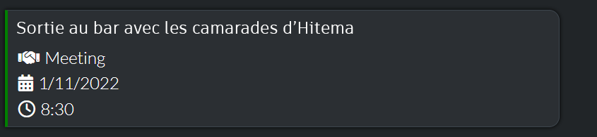
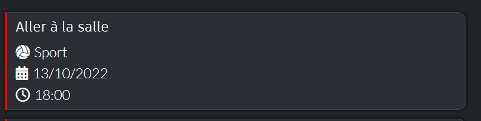
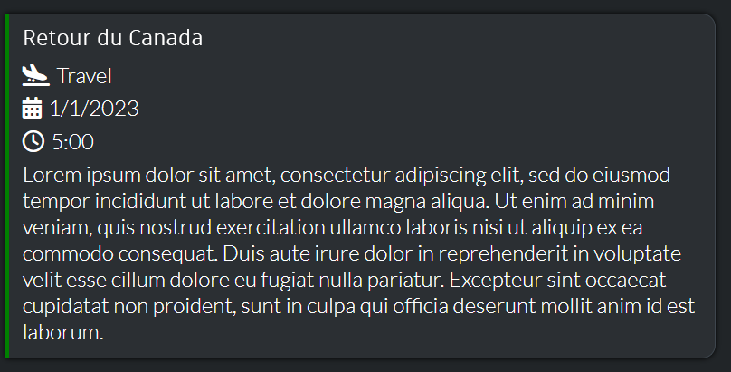
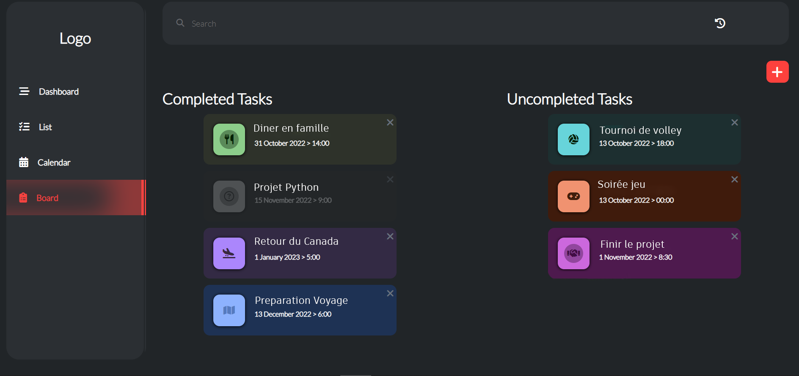
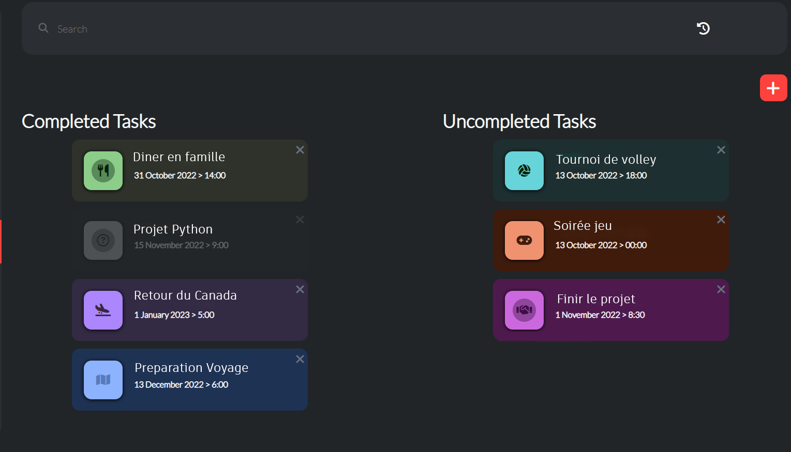
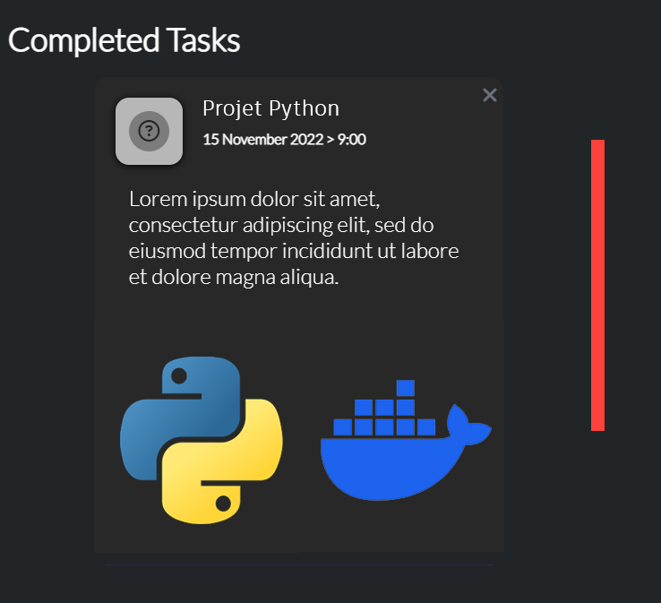
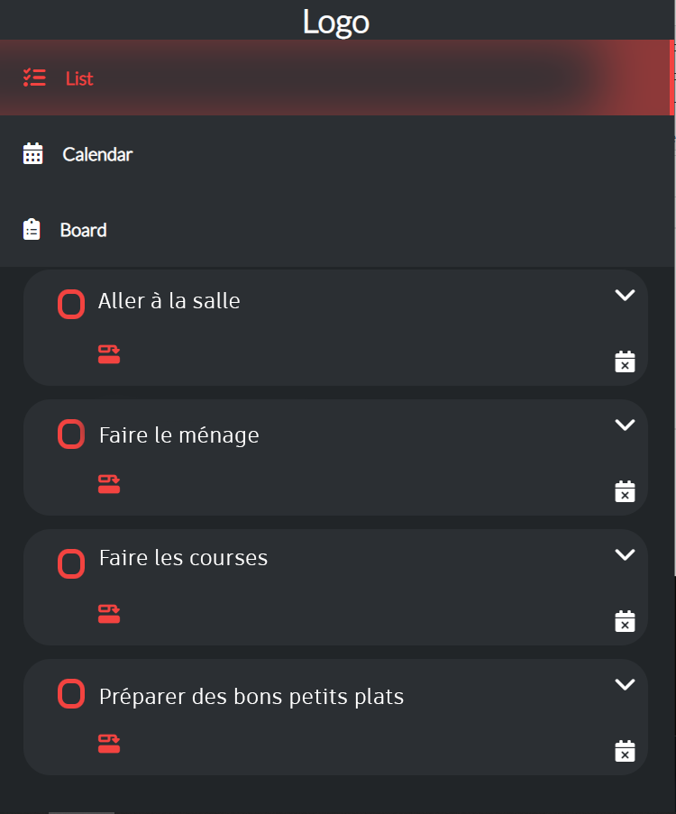

# Application Web de gestionnaire de tâches

Une application de gestion de tâches inspirée de JIRA qui vous permet de gérer vos tâches quotidiennes.

**Description du Projet :**

Notre projet consiste en une application full stack basée sur une architecture de microservices, déployée à l'aide de conteneurs Docker. L'objectif principal est de créer une application de gestion de tâches, offrant des fonctionnalités de création, de mise à jour et de suppression de tâches, avec un frontend en React et un backend en Flask. La base de données MySQL stocke les informations sur les tâches.

**Architecture du Projet :**

- **Frontend en React** : Le frontend est développé en React, fournissant une interface utilisateur réactive avec une page d'accueil pour la liste des tâches et une route générique pour la gestion individuelle des tâches.

- **Backend en Flask** : Le backend est implémenté en utilisant Flask, un framework web Python, offrant des API endpoints pour les opérations CRUD. L'authentification est assurée à l'aide de jetons JWT pour la sécurité.

- **Base de Données MySQL** : La base de données MySQL stocke les informations sur les tâches, avec une table et un schéma explicite.

- **Docker et Docker Compose** : Les composants du projet sont conteneurisés avec Docker, et Docker Compose est utilisé pour orchestrer ces conteneurs, facilitant ainsi le déploiement et la gestion.

**Technologies Prévues :**

- **Frontend :** React
- **Backend :** JavaScript
- **Base de Données :** MongoDB
- **Conteneurs :** Docker
- **Orchestration :** Docker Compose
- **Tests :** Fichiers de tests pour la santé des conteneurs, les fonctionnalités de l'application, et les tests de base de données.

Ce projet permet d'illustrer une approche complète de développement et de déploiement d'une application full stack moderne en utilisant une architecture de microservices et des technologies contemporaines.

**SCHÉMA DE L'APPLICATION :**

## Configuration de l'environnement de développement
1. **Prérequis**
   - Vous devez avoir [node.js](https://nodejs.org/en/) installé sur votre machine.
2. **Installation des dépendances**
   - Ce projet est partagé sans le dossier node_modules, vous devez donc installer toutes les dépendances vous-même.
   - Pour installer les dépendances :
      Ouvrez votre ligne de commande.
      Accédez aux répertoires suivants : `/frontend/task-manager-app/` et `/backend`.
      Exécutez `npm install` ou `npm i` pour installer toutes les dépendances.
3. Après avoir installé toutes les dépendances, vous êtes prêt à lancer l'application :
   - Pour démarrer l'application, exécutez `npm start` dans les deux répertoires.

## Fonctionnalités
### 1. Vues multiples
   
 Il existe 3 façons de voir et de gérer vos tâches : 

1. **Vue en liste** :

   

   - Vous pouvez faire glisser le texte pour changer son état ou cliquer sur la case à cocher.
   - Cliquez sur l'icône de menu déroulant pour afficher les informations que vous avez saisies sur la tâche :

   

2. **Vue calendrier** :
   - Vous pouvez naviguer pour voir vos projets avec un calendrier personnalisé :

   

   - Les jours qui ont une ou plusieurs tâches sont mis en évidence :
   
   

   - Les tâches terminées ont une bordure verte :

   

   - Tandis que les tâches non terminées ont une bordure rouge :

   

   - Cliquez sur l'icône de menu déroulant pour afficher les informations que vous avez saisies sur la tâche :

   

3. **Vue en tableau** :
      

   - Vous pouvez faire glisser le texte pour changer son état :

   

   - Cliquez sur l'icône de menu déroulant pour afficher les informations que vous avez saisies sur la tâche :

   

### 2. Notifications

 Vous êtes notifié pour chaque action que vous effectuez 

   
   

### 3. Responsive
L'application est entièrement responsive :

   

